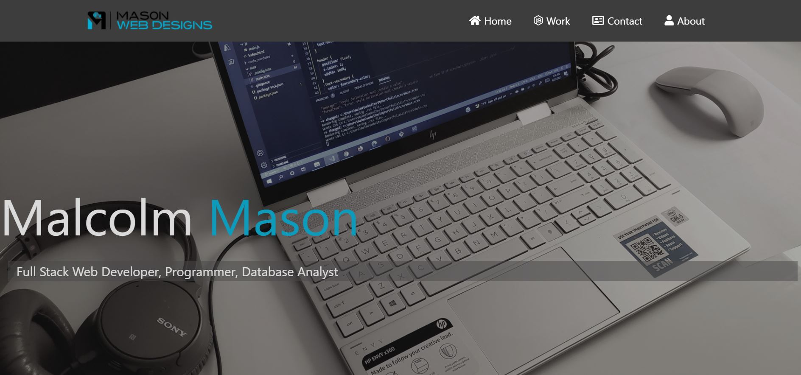
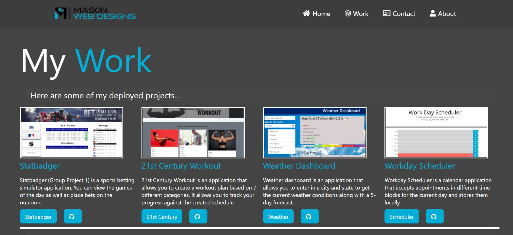
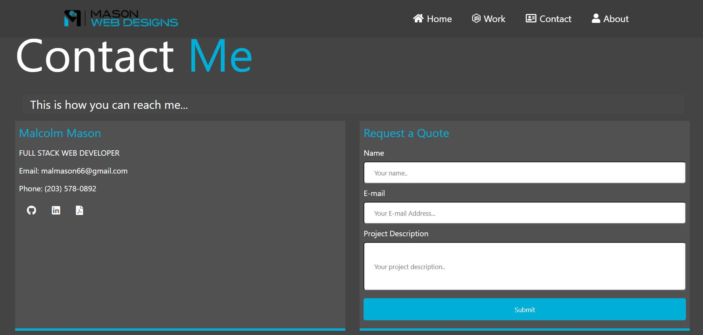

# My Profile - REACT Version

## Description

> This is my personal website portfolio showing my completed projects as well as some upcoming projects for my clients. This website has been completely re-designed utilizing CSS Grid for the layout and SASS for the compiled CSS. This site has been done over using react components for the front-end.

## 🧰 Technologies Used

* `Node.js`
* `npm (Node Package Manager)`
* `Javascript`
* `React`
* `Fontawesome`
* `CSS Grid`
* `React Router`

## 📸 Screenshots

> About Me: The about page displays my most recent work history along with my technical skills. 

> My Work: On the My Work page, you can find samples of my solo and group projects. Here you can also find information on upcoming projects i have with prospective clients. 

> Contact Me: The contact me section of the site has my personal contact information along with a link to my resume. There is a form to request a quote for your project that you would like to contract out for building. This form will be activited once the portfolio website has been deployed to [Bluehost](https://www.bluehost.com/).

## 🔗 Application Links
* [Github](https://github.com/malmason/reactprofile)
* [Live Deployment](https://malmason.github.io/reactprofile/)

## 📱 Contact 

Malcolm Mason - [Github](https://github.com/malmason) Email: [Malcolm](mailto:malmason66@gmail.com) 📧

---

&copy; 2021 Malcolm Mason
